<div align="center">


# Droid Mobile

**Your Factory Droid sessions, in your pocket.** An unofficial Android client for the Droid
coding agent that talks directly to the `droid daemon` on your own PC.

[](https://github.com/kodji7202-code/droid-mobile-android/actions/workflows/ci.yml)
[](https://github.com/kodji7202-code/droid-mobile-android/releases/latest)
[](LICENSE)
[](docs/android.md)
[](https://capacitorjs.com)
[](https://react.dev)
[](https://www.typescriptlang.org)

</div>

> [!IMPORTANT]
> **Droid Mobile is an unofficial, community project.** It is not made, endorsed, sponsored or
> supported by Factory, and it is not affiliated with Factory. "Factory" and "Droid" are
> trademarks of their respective owners. The app uses only public interfaces: the Apache-2.0
> `@factory/droid-sdk` and your own `droid daemon`, with your own Factory API key. There is no
> relay server, no reuse of Factory's OAuth or WorkOS sign-in and no non-public API. Read the
> [terms-of-service note](docs/tos.md) before you publish or share a build.

## Table of contents

- [Overview](#overview)
- [Screenshots](#screenshots)
- [Features](#features)
- [Architecture](#architecture)
- [Tech stack](#tech-stack)
- [Requirements](#requirements)
- [Quick start](#quick-start)
- [Building from source](#building-from-source)
- [Configuration](#configuration)
- [Usage guide](#usage-guide)
- [Security and privacy](#security-and-privacy)
- [Testing and quality](#testing-and-quality)
- [Project structure](#project-structure)
- [Known limitations](#known-limitations)
- [Roadmap](#roadmap)
- [FAQ](#faq)
- [Contributing](#contributing)
- [License](#license)
- [Acknowledgements](#acknowledgements)

## Overview

Droid Mobile lets you start, follow and steer Droid sessions that run on your own computer from
an Android phone or tablet. It is for developers who already use the Droid CLI or desktop app and
want to check on a long turn, approve a tool call or read a diff without going back to the PC. It
aims for parity with the Factory desktop and web apps wherever the public interfaces allow it.

How it works, in three bullets:

- **Direct connection.** The app opens a WebSocket (JSON-RPC through `@factory/droid-sdk`) to the
  `droid daemon` on your PC and signs in with your Factory API key. Over
  [Tailscale Serve](docs/setup.md#tailscale-serve-and-https-certificates) this is a `wss://`
  address that is reachable only inside your tailnet.
- **Everything stays on your machines.** Prompts, files and diffs travel between your phone and
  your PC. Nothing goes through a server that this project operates, and the app has no
  analytics or crash reporting.
- **Optional push.** A small self-hosted bridge turns Droid hook events into minimal Firebase
  Cloud Messaging pushes (event kind and session id only) so you are notified even when the app
  is closed.

## Screenshots

All screenshots come from the real web build running against a real `droid daemon`, using a
scratch Factory home and a small throwaway demo project (no personal sessions, keys or hostnames).

<table>
  <tr>
    <td align="center" width="33%">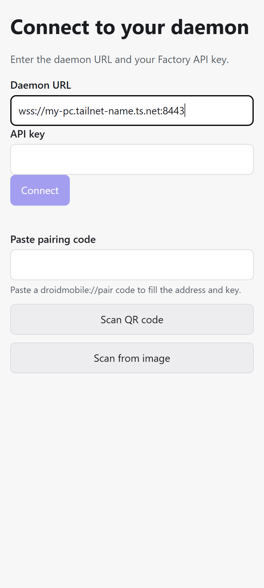<br><sub><b>Connect</b>: daemon URL and API key, or a pairing code, QR or text</sub></td>
    <td align="center" width="33%">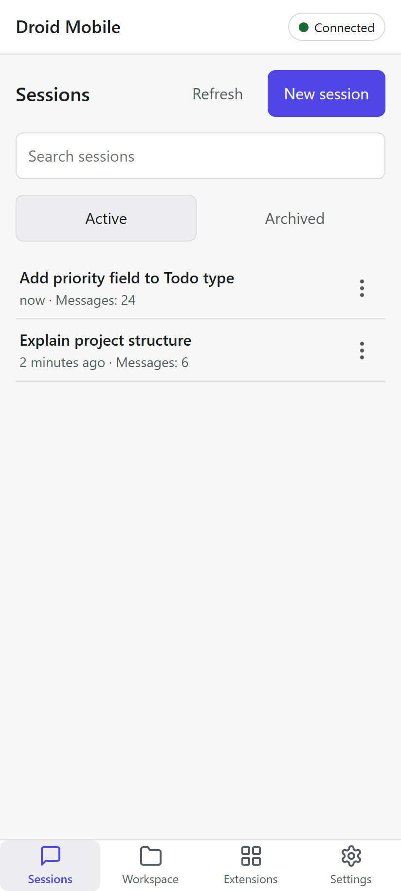<br><sub><b>Sessions</b>: search, resume, archive</sub></td>
    <td align="center" width="33%">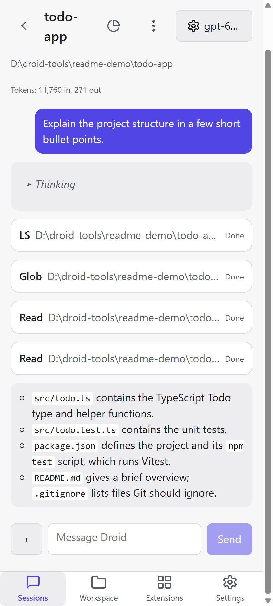<br><sub><b>Chat</b>: streamed reply with tool calls</sub></td>
  </tr>
  <tr>
    <td align="center">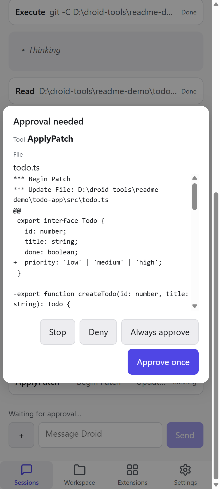<br><sub><b>Approvals</b>: review the patch, approve once, always approve or deny</sub></td>
    <td align="center">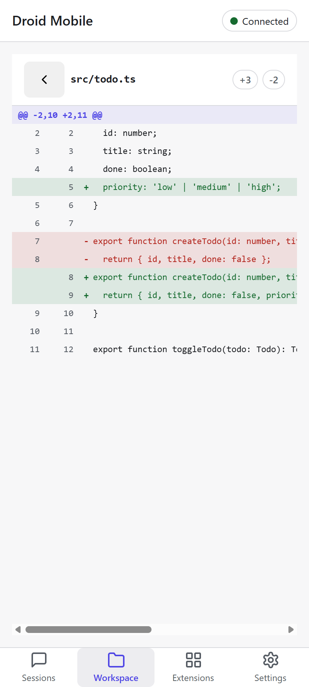<br><sub><b>Workspace</b>: git changes and diffs</sub></td>
    <td align="center">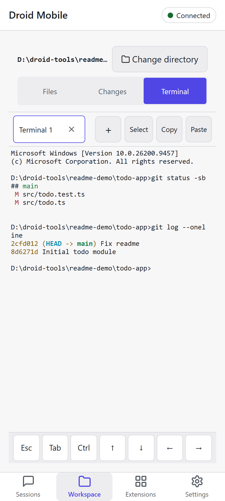<br><sub><b>Terminal</b>: a shell on the PC with an extra-key row</sub></td>
  </tr>
  <tr>
    <td align="center">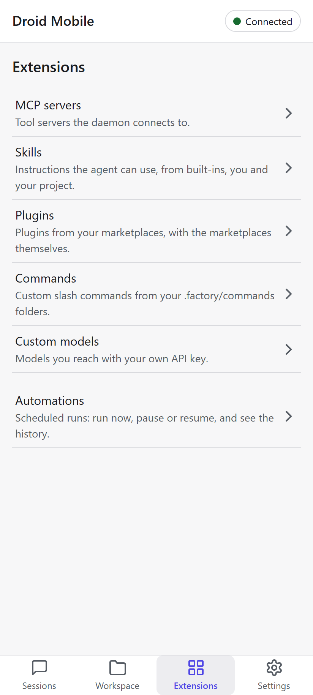<br><sub><b>Extensions</b>: MCP, skills, plugins, commands, models, automations</sub></td>
    <td align="center">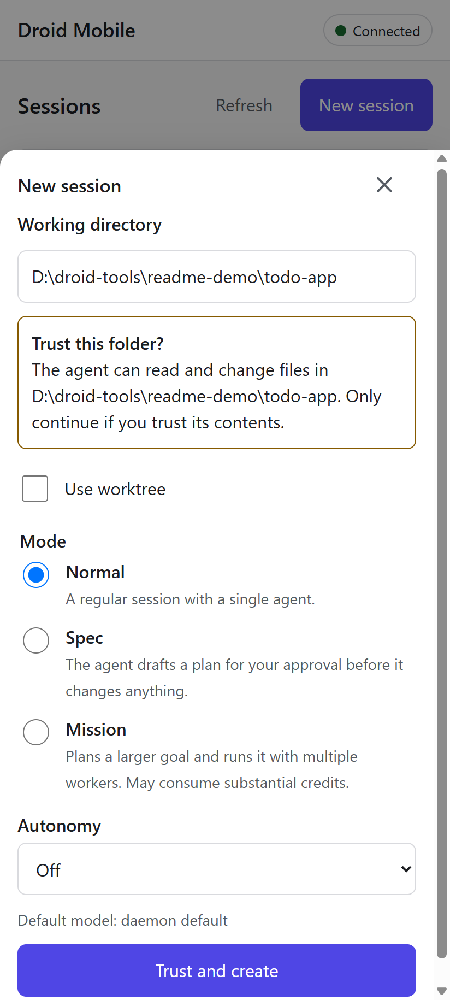<br><sub><b>New session</b>: folder trust, normal, spec or mission mode, autonomy</sub></td>
    <td align="center">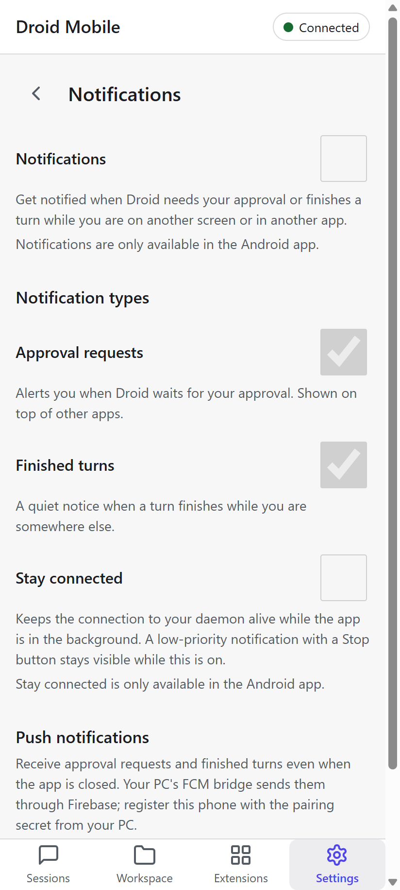<br><sub><b>Notifications</b>: the web preview shows the switches disabled; they are active in the Android app</sub></td>
  </tr>
  <tr>
    <td align="center">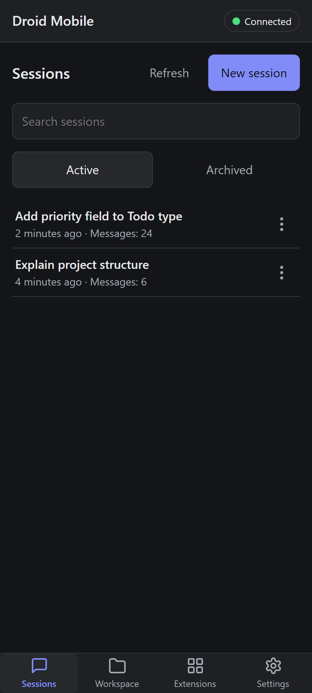<br><sub><b>Dark theme</b>: sessions</sub></td>
    <td align="center">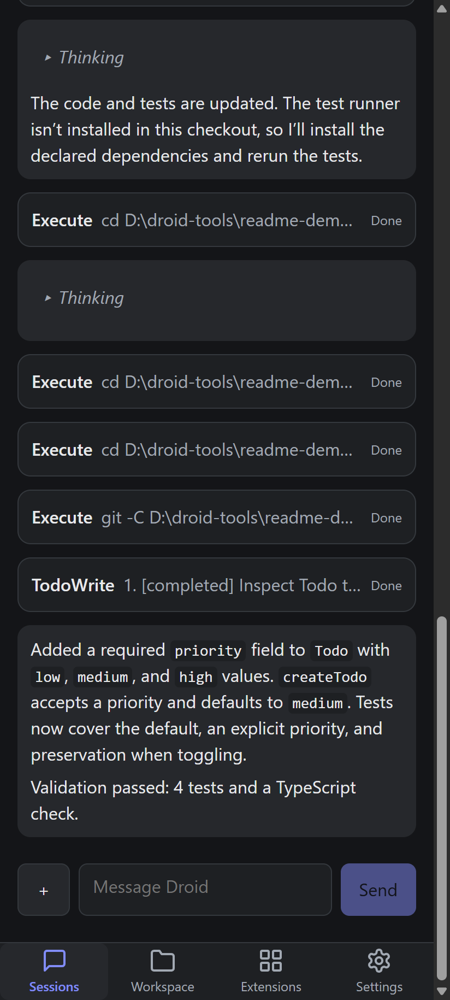<br><sub><b>Dark theme</b>: chat result</sub></td>
    <td align="center">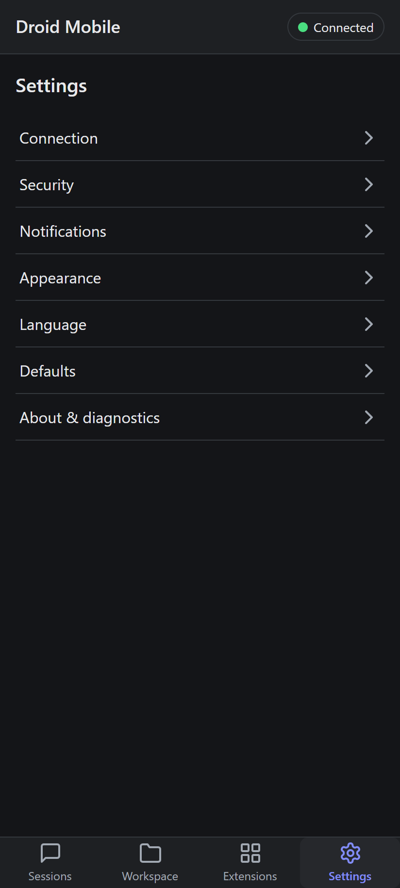<br><sub><b>Dark theme</b>: settings</sub></td>
  </tr>
</table>

<p align="center">
  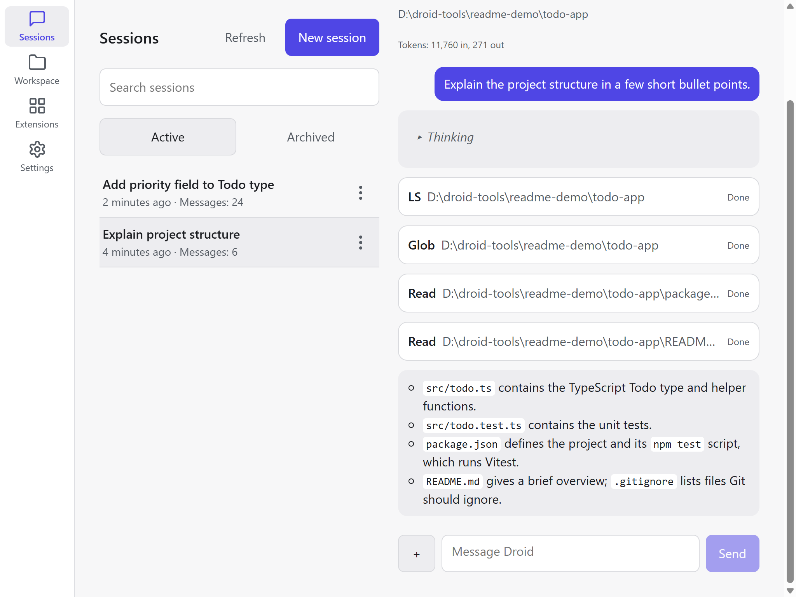<br>
  <sub><b>Tablet</b>: two-pane Sessions view (also used by Workspace and Settings)</sub>
</p>

## Features

**Connection and security**

- API-key sign-in; the key is kept in Android Keystore-backed secure storage.
- Pairing by code: scan a QR, read a QR from an image, or paste text. Several saved connections.
- Optional app lock with fingerprint, face or screen lock.
- Release builds accept `wss://` only.

**Sessions and chat**

- Session list with search, create, resume, rename and archive; worktree sessions, spec mode and
  Mission mode when you create one.
- Chat with streaming replies, tool calls, diffs and file attachments.
- Model, reasoning effort and autonomy selection per session; interrupt a running turn; context
  usage sheet.
- Permission approvals and agent questions as dialogs.

**Workspace**

- File tree with search and a syntax-highlighting file viewer.
- Git status, diffs, commit, branches and push.
- Terminal on the PC (`cmd.exe`) with an extra-key row.

**Extensions**

- MCP servers (including OAuth sign-in), skills, custom slash commands, plugins and
  marketplaces, custom models and automations (run now, pause, resume, history).

**Missions**

- Missions UI to start a Mission session and follow its features and workers. Real Mission runs
  have not been exercised yet ([limitations](docs/limitations.md)).

**Notifications and background delivery**

- Local notifications for approvals (with an **Approve** action) and finished turns, on separate
  Android channels.
- **Stay connected** foreground service that keeps long turns alive with the screen off.
- Push through your own FCM bridge when the app is closed, with pairing, de-duplication against
  local notifications, deep links into the session and a truthful turn-off flow.

**Experience**

- English and Romanian UI, light and dark themes, tablet two-pane layouts for Sessions, Workspace
  and Settings, accessibility support, and performance budgets (see
  [Testing and quality](#testing-and-quality)).

**PC tooling**

- A PowerShell module that runs the daemon under a supervisor, publishes it with Tailscale Serve,
  prints pairing codes, installs the Droid hooks for push and runs a `Doctor` health check.
- Signed release APK and AAB pipeline with automated verification.

## Architecture

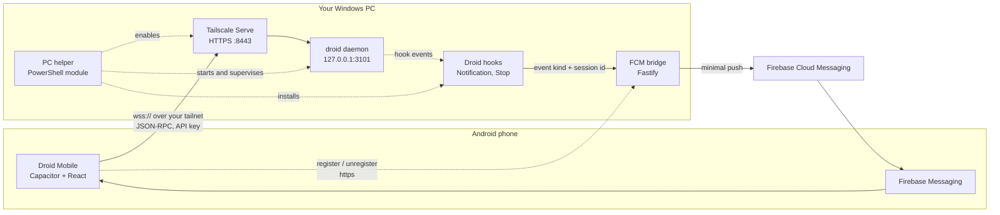

| Component                                     | Folder                                             | Role                                                                                                             |
| --------------------------------------------- | -------------------------------------------------- | ---------------------------------------------------------------------------------------------------------------- |
| Mobile app (`@droidmobile/mobile`)            | [`apps/mobile`](apps/mobile)                       | React UI, Capacitor plugins and the native Android shell (`android/`)                                            |
| Daemon adapter (`@droidmobile/daemon-client`) | [`packages/daemon-client`](packages/daemon-client) | Typed, framework-free adapter over `@factory/droid-sdk` (reconnects, normalised events)                          |
| FCM bridge (`@droidmobile/fcm-bridge`)        | [`server/fcm-bridge`](server/fcm-bridge)           | Receives Droid hook events and sends minimal FCM pushes ([README](server/fcm-bridge/README.md))                  |
| PC helper (`@droidmobile/pc-helper`)          | [`tools/pc-helper`](tools/pc-helper)               | PowerShell module for daemon, Tailscale Serve, pairing, hooks and `Doctor` ([README](tools/pc-helper/README.md)) |
| Dev scripts                                   | [`tools/dev`](tools/dev)                           | Android build, release signing and verification, secret scan, docs and bundle checks                             |
| Documentation                                 | [`docs`](docs/README.md)                           | Setup, pairing, notifications, security, release, troubleshooting                                                |

## Tech stack

| Layer             | Technology                                                                                           | Version                                           |
| ----------------- | ---------------------------------------------------------------------------------------------------- | ------------------------------------------------- |
| App shell         | Capacitor (Android)                                                                                  | 8.5.2                                             |
| UI                | React, React Router, Zustand                                                                         | 19.3.0, 7.18.4, 5.0.15                            |
| Language          | TypeScript                                                                                           | 6.0.3 (bridge: 7.0.2)                             |
| Build tool        | Vite                                                                                                 | 8.3.2                                             |
| Daemon protocol   | `@factory/droid-sdk` (Apache-2.0)                                                                    | 0.9.1                                             |
| UI libraries      | i18next / react-i18next, xterm.js, react-markdown, highlight.js, TanStack Virtual                    | 26.4.2 / 17.0.15, 6.0.0, 10.1.0, 11.11.1, 3.14.13 |
| Native plugins    | Secure storage, biometric auth, Firebase Messaging, ML Kit barcode scanning, Filesystem, Preferences | see `apps/mobile/package.json`                    |
| Push bridge       | Fastify, firebase-admin, @fastify/rate-limit                                                         | 5.12.5, 14.5.0, 11.2.0                            |
| Android build     | Android Gradle Plugin, Gradle, Kotlin, JDK                                                           | 8.13.0, 8.14.3, 2.2.20, 21                        |
| Android targets   | minSdk / compileSdk / targetSdk                                                                      | 24 / 36 / 36                                      |
| Tests and linting | Vitest, Testing Library, jsdom, ESLint, Prettier                                                     | 5.0.3, 16.3.3, 29.1.1, 10.12.0, 3.9.9             |
| PC tooling        | Windows PowerShell 5.1+, Node.js                                                                     | 5.1+, 24                                          |

## Requirements

**PC (runs the daemon)**

- Windows 10 or 11 with Windows PowerShell 5.1 or later (the helper also runs on PowerShell 7).
  On other systems you can still start `droid daemon` and Tailscale Serve by hand
  ([setup](docs/setup.md)).
- Node.js 24 (npm 11) and git.
- The Droid CLI (`droid`) on `PATH` or in `%USERPROFILE%\bin`, signed in to Factory.
- Tailscale on the PC and the phone (same tailnet) with **MagicDNS** and **HTTPS certificates**
  enabled.
- Your own Factory API key (`fk-...`).

**Phone**

- Android 7.0 (API 24) or later.

**To build the app**

- JDK 21 and the Android SDK (platform 36). Details: [docs/android.md](docs/android.md).

**Optional, for push notifications**

- Your own Firebase project and a place to run the bridge with HTTPS (a TLS reverse proxy such as
  Caddy or nginx, or a container). See [docs/notifications.md](docs/notifications.md).

## Quick start

### Download

Prebuilt signed APK: [latest release](https://github.com/kodji7202-code/droid-mobile-android/releases/latest). Note that push notifications through FCM in the prebuilt APK work only for the maintainer's Firebase project; everyone else gets local notifications and Stay connected mode, or can build their own APK with their own google-services.json ([docs/notifications.md](docs/notifications.md)).

### 1. Set up the PC

```powershell
git clone https://github.com/kodji7202-code/droid-mobile-android.git
cd droid-mobile-android
npm ci

Import-Module .\tools\pc-helper\DroidMobileHelper.psd1
Start-DroidDaemon -Port 3101                        # supervised droid daemon on 127.0.0.1:3101
Enable-TailscaleServe -Port 8443 -DaemonPort 3101   # prints URL: wss://<your-pc>.<tailnet>.ts.net:8443
Doctor -DaemonPort 3101                             # PASS / WARN / FAIL per check, with fixes
New-PairingCode                                     # prints a droidmobile://pair code and a QR
```

The helper records what it changes and can undo it (`Disable-TailscaleServe`,
`Stop-DroidDaemon`). Every command accepts `-WhatIf`. Details: [docs/setup.md](docs/setup.md) and
the [helper README](tools/pc-helper/README.md).

### 2. Install the app on the phone

There is no published release yet, so build the APK from source
([Building from source](#building-from-source)) and install it with `adb`:

```powershell
adb install apps\mobile\android\app\build\outputs\apk\release\app-release.apk
```

When a release APK is published, it will be listed on the repository's Releases page, and you can
verify its signature as described in [docs/release.md](docs/release.md).

### 3. Connect

Open the app and either type the **Daemon URL** (`wss://my-pc.tailnet-name.ts.net:8443`) and your
**API key**, or scan or paste the pairing code from step 1 and then enter the key. The key is
never part of the code unless you ask for it with `New-PairingCode -IncludeApiKey`. See
[docs/pairing.md](docs/pairing.md).

### 4. Optional: push and Stay connected

- **Stay connected** and local notifications need no server: open **Settings > Notifications**.
- **Push** needs the bridge, the Droid hooks and a Firebase project of your own. In short: build the
  app with your `google-services.json`, run the bridge behind HTTPS, run `Install-DroidHooks`, then
  register the phone from **Settings > Notifications > Push notifications** with a pairing code
  from `New-PairingCode -BridgeUrl <https-url> -BridgeSecretFile .\pair-secret.txt`. The full
  walkthrough is [docs/notifications.md](docs/notifications.md).

If something does not connect, start with [docs/troubleshooting.md](docs/troubleshooting.md) and
`Doctor`.

## Building from source

```powershell
git clone https://github.com/kodji7202-code/droid-mobile-android.git
cd droid-mobile-android
npm ci
```

**Web development build** (runs in a desktop browser against a `ws://127.0.0.1:<port>` daemon):

```powershell
npm run dev -w @droidmobile/mobile   # Vite on http://127.0.0.1:3100 (the port is fixed)
```

**Android debug build** (allows cleartext `ws://` for the emulator and `adb reverse`; never ship it):

```powershell
powershell -NoProfile -ExecutionPolicy Bypass -File tools\dev\build-android.ps1 -Variant debug
# same as: npm run android:debug
```

The APK is written to `apps/mobile/android/app/build/outputs/apk/debug/app-debug.apk`.

**Signed release build** (`wss://` only):

```powershell
npm run android:keystore         # once: creates secrets\release.keystore and secrets\keystore.properties
npm run android:release          # web build, cap sync, assembleRelease + bundleRelease, then verification
npm run android:verify-release   # re-run the apksigner, manifest and secret checks
```

`android:release` creates the keystore on first use if it does not exist. The keystore, its
generated password and `keystore.properties` live in `secrets/` and are git-ignored. **Back them
up**: without the same key an installed app cannot be updated. Outputs are `app-release.apk` and
`app-release.aab` under `apps/mobile/android/app/build/outputs/`
([docs/release.md](docs/release.md)).

**Firebase for push.** Create your own Firebase project, add an Android app with the id
`com.droidmobile.client`, and save its `google-services.json` as `secrets/google-services.json`
(or point `GOOGLE_SERVICES_JSON_PATH` at it). The build script copies it into the app. Without it
the app still builds and works, but push is disabled. A build is tied to the Firebase project it
was built with.

**FCM bridge.**

```powershell
$env:BRIDGE_DATA_DIR = "$env:LOCALAPPDATA\DroidMobileBridge"   # use the same value every time
npm run generate-secret -w @droidmobile/fcm-bridge             # prints the pairing secret once
npm run build -w @droidmobile/fcm-bridge
$env:FIREBASE_SERVICE_ACCOUNT_PATH = 'C:\path\to\service-account.json'
node server/fcm-bridge/dist/server.js                          # or: npm run dev -w @droidmobile/fcm-bridge
```

Set `$env:BRIDGE_DRY_RUN = '1'` to try everything without sending. Put a TLS reverse proxy in front
of the bridge for anything beyond loopback ([bridge README](server/fcm-bridge/README.md#deploy-behind-tls)).

### Root npm scripts

Run them from the repository root.

| Script                                                       | What it does                                                                |
| ------------------------------------------------------------ | --------------------------------------------------------------------------- |
| `npm run typecheck`                                          | `tsc --noEmit` in every workspace                                           |
| `npm run lint`                                               | ESLint over the repository (including the "no hard-coded UI strings" rule)  |
| `npm run test`                                               | Vitest `unit` project                                                       |
| `npm run test:integration`                                   | Vitest `integration` project; needs a real daemon on 127.0.0.1:3101         |
| `npm run build`                                              | Workspace builds (Vite production build of the app, bridge compile)         |
| `npm run i18n:check`                                         | English and Romanian bundles have the same keys and placeholders            |
| `npm run docs:check`                                         | Documentation gate: required sections, relative links, `npm run` scripts    |
| `npm run bundle:budget`                                      | Initial JavaScript size against the gzip budget (run after `npm run build`) |
| `npm run scan:secrets`                                       | Scan the tree and history for keys, service accounts and signing files      |
| `npm run format` / `format:check`                            | Prettier write / check                                                      |
| `npm run android:debug`                                      | Debug APK (web build, `cap sync`, `gradlew assembleDebug`)                  |
| `npm run android:release`                                    | Signed release APK and AAB, then `android:verify-release`                   |
| `npm run android:keystore`                                   | Create the local release keystore once (never overwrites)                   |
| `npm run android:verify-release`                             | `apksigner`, manifest, config and secret checks on the release artifacts    |
| `npm run android:check`                                      | Debug and release variant checks (merged manifests, Capacitor config)       |
| `npm run android:sync`                                       | Web build and `cap sync` only                                               |
| `npm run android:icons`                                      | Regenerate the launcher and splash art                                      |
| `npm run android:emulator`, `android:install`, `android:cdp` | Emulator helpers, see [docs/android.md](docs/android.md)                    |

Scope a script to one workspace with `-w`, for example `npm run test -w @droidmobile/fcm-bridge`.

## Configuration

Create `.env.local` from [`.env.example`](.env.example). It is git-ignored and every variable is
optional unless you use the feature that reads it. Load it into a command without printing the
values:

```powershell
powershell -NoProfile -ExecutionPolicy Bypass -File tools\dev\with-env.ps1 <command> [args...]
```

| Variable                                                                                                                                                                                | Read by                                                          | Purpose                                                                           |
| --------------------------------------------------------------------------------------------------------------------------------------------------------------------------------------- | ---------------------------------------------------------------- | --------------------------------------------------------------------------------- |
| `FACTORY_API_KEY`                                                                                                                                                                       | integration tests, dev scripts, `New-PairingCode -IncludeApiKey` | Your Factory API key (the app itself asks for it on the Connect screen)           |
| `GOOGLE_SERVICES_JSON_PATH`                                                                                                                                                             | `build-android.ps1`                                              | `google-services.json` of your Firebase project                                   |
| `DROID_KEYSTORE_PROPERTIES`                                                                                                                                                             | Gradle                                                           | Alternative `keystore.properties` location                                        |
| `DROIDMOBILE_TOOLS_DIR`                                                                                                                                                                 | `env-android.ps1`                                                | Optional folder with `jdk-21`, `gradle-home`, `avd`                               |
| `FIREBASE_SERVICE_ACCOUNT_PATH`                                                                                                                                                         | FCM bridge                                                       | Firebase service account JSON (required unless dry-run)                           |
| `PORT`, `BRIDGE_HOST`, `BRIDGE_DATA_DIR`, `BRIDGE_DRY_RUN`, `BRIDGE_RATE_LIMIT_MAX`, `BRIDGE_RATE_LIMIT_WINDOW_MS`, `BRIDGE_BODY_LIMIT_BYTES`, `BRIDGE_TRUST_PROXY`, `BRIDGE_LOG_LEVEL` | FCM bridge                                                       | Server settings, see the [bridge README](server/fcm-bridge/README.md#environment) |
| `DROIDMOBILE_DROID_EXE`, `DROIDMOBILE_TAILSCALE_EXE`, `DROIDMOBILE_HELPER_HOME`, `DROIDMOBILE_BRIDGE_URL`, `DROIDMOBILE_BRIDGE_SECRET`                                                  | PC helper and hook                                               | Overrides for tool paths, state folder and bridge                                 |
| `DC_TEST_DAEMON_URL`, `DC_TEST_DROID_EXE`                                                                                                                                               | integration tests                                                | Daemon address and `droid` executable for the tests                               |

## Usage guide

- **Connect and pair.** Enter the URL and key or use a pairing code; manage several connections in
  **Settings > Connection**. [docs/pairing.md](docs/pairing.md)
- **Sessions.** The Sessions tab lists active and archived sessions with search. **New session**
  asks for a working directory (and a folder trust confirmation the first time), a mode (normal,
  spec or Mission) and the autonomy level.
- **Chat.** Type a message or attach a file. Expand tool cards to see inputs and results. Use the
  session settings sheet to change model, reasoning effort and autonomy; **Stop** interrupts a turn.
  When the agent needs permission or asks a question, a dialog appears.
- **Workspace.** Pick a folder, then use the **Files**, **Changes** and **Terminal** tabs. The
  **Changes** tab lists modified files with diffs and offers **Commit**, **Push** and branches.
- **Extensions.** The hub opens MCP servers, skills, plugins, commands, custom models and
  automations. MCP OAuth sign-in from a phone has a caveat, see
  [limitations](docs/limitations.md#mcp-sign-in-from-the-phone).
- **Notifications.** **Settings > Notifications** has the switches for approvals, finished turns,
  **Stay connected**, battery guidance and push registration.
  [docs/notifications.md](docs/notifications.md)
- **Appearance and language.** **Settings > Appearance** (system, light, dark) and
  **Settings > Language** (English, Romanian).
- **Security.** **Settings > Security** turns on the app lock. **Settings > About & diagnostics**
  exports a redacted log bundle you can inspect and share.

All documents are indexed in [docs/README.md](docs/README.md).

## Security and privacy

- **Where the API key lives.** In Android Keystore-backed secure storage on the phone. It is never
  written to web storage, URLs, logs, crash reports or backups (`allowBackup` is off). The web build
  keeps it in memory only.
- **Nothing is logged.** Errors and diagnostics redact keys, tokens and bridge secrets. There is no
  analytics and no crash reporting.
- **Transport.** Release builds connect over `wss://` only and refuse `ws://` before opening a
  socket. The daemon listens on `127.0.0.1`; Tailscale Serve adds TLS and limits reach to your
  tailnet. Do not use Tailscale Funnel for this daemon.
- **Minimal push.** The FCM payload contains exactly two data fields, `kind` and `sessionId`, with a
  fixed title and text ("Open the app to see what needs your attention."). No prompt, file
  content, path or tool input leaves the PC.
- **Bridge authentication.** Every bridge request needs a bearer pairing secret that is shown once
  and stored only as a salted scrypt hash; requests are rate limited and bodies are size capped.
  The bridge speaks plain HTTP, so put TLS in front of it.
- **Optional app lock** (fingerprint, face or screen lock).
- **Repository hygiene.** `npm run scan:secrets` checks the tree and history for keys,
  service accounts and signing files; keystores, `google-services.json` and `.env.local` are
  git-ignored.

Full details in [docs/security.md](docs/security.md). To report a vulnerability, follow
[SECURITY.md](SECURITY.md).

## Testing and quality

| Command                     | What it checks                                                                                                                                  |
| --------------------------- | ----------------------------------------------------------------------------------------------------------------------------------------------- |
| `npm run typecheck`         | Strict TypeScript in all workspaces                                                                                                             |
| `npm run lint`              | ESLint, React hooks rules, no hard-coded UI strings                                                                                             |
| `npm run test`              | About 1,700 unit and component tests (Vitest, Testing Library)                                                                                  |
| `npm run test:integration`  | Adapter and helper tests against a real daemon (needs `FACTORY_API_KEY` and a daemon on 3101; costs a little credit)                            |
| `npm run i18n:check`        | Same keys and placeholders in `en.json` and `ro.json`                                                                                           |
| `npm run docs:check`        | Required sections, relative links and referenced npm scripts                                                                                    |
| `npm run bundle:budget`     | Initial JavaScript within the 390 KiB gzip budget (entry and bootstrap chunks are about 310 KiB; the SDK, terminal and file viewer load lazily) |
| `npm run scan:secrets`      | No secrets or signing files in the tree or history                                                                                              |
| `gradlew testDebugUnitTest` | JVM tests of the native shell (run from `apps/mobile/android`)                                                                                  |
| `npm run android:check`     | Debug and release manifests and Capacitor config stay on-policy                                                                                 |

Integration tests run the real daemon with your key; they are not part of CI.

How it was validated: the unit suite and JVM tests above, end-to-end checks against a real daemon
on the web build, on an Android emulator and on a physical Galaxy S25 (357 behavioural assertions
passed), and a signed release build verified with `apksigner`. Missions were not exercised with
real runs. CI ([workflow](.github/workflows/ci.yml)) runs typecheck, lint, unit tests, the i18n and
docs gates, the build, the bundle budget and the secret scan on `windows-latest`.

## Project structure

```text
.
├── apps/
│   └── mobile/               Capacitor + React app (src/, android/ native shell)
├── packages/
│   └── daemon-client/        Adapter over @factory/droid-sdk (pure TypeScript)
├── server/
│   └── fcm-bridge/           Fastify push bridge (README, Dockerfile)
├── tools/
│   ├── dev/                  Build, release, secret-scan and docs scripts
│   ├── eslint/               Local ESLint rule: no hard-coded UI strings
│   └── pc-helper/            PowerShell module (daemon, Tailscale Serve, hooks, pairing)
├── docs/                     Documentation and screenshots (docs/images)
├── .github/                  CI workflow, issue and pull request templates
├── .env.example              Documented environment variables (placeholders only)
├── CONTRIBUTING.md  SECURITY.md  CODE_OF_CONDUCT.md  CHANGELOG.md
└── LICENSE  NOTICE
```

## Known limitations

A short summary; the full list is in [docs/limitations.md](docs/limitations.md).

- The daemon must be running and reachable; the phone cannot start it.
- MCP OAuth sign-in from the phone only completes when the daemon's callback address is reachable
  from the phone's browser; otherwise sign in from the desktop.
- Missions have not been exercised with real runs and can use many credits.
- Release builds need `wss://`; plain `ws://` works in debug builds only.
- Android may pause the app in the background; turn on **Stay connected** and exempt the app from
  battery optimisation. Android 15 limits how long the foreground service may run.
- Push text is a fixed English string; push needs your own bridge, TLS and Firebase project.
- The Docker image for the bridge has only been checked statically.
- English and Romanian only. No iOS app, no relay or cloud account.

## Roadmap

Ideas, not commitments:

- Localized push text.
- Published, signed release builds on GitHub Releases.
- Running the Gradle unit tests in CI.
- More Mission coverage once real runs have been exercised.

Suggestions are welcome as [feature requests](https://github.com/kodji7202-code/droid-mobile-android/issues/new/choose).

## FAQ

**Do I need Tailscale?** Release builds need a `wss://` address, and Tailscale Serve is the easiest
way to get a trusted TLS address for the daemon without exposing it to the internet. Any other
setup that gives your daemon a valid `wss://` URL (for example a reverse proxy you secure
yourself) also works. A debug build can use `ws://` for the emulator and through `adb reverse`.

**Is my API key sent anywhere else?** The key is stored on the phone and sent only to the daemon
address you configured, to sign in. The app has no backend of its own and no analytics. Your own
daemon, like the CLI, still talks to Factory's services as usual.

**Does it work without push?** Yes. In-app and local notifications work while the app process is
alive, and **Stay connected** keeps it alive for long turns. Push is only needed to be notified
when the app is closed or frozen.

**Does it work on iOS?** No. Only Android is supported.

**How much battery does it use?** Normally very little. **Stay connected** runs a foreground
service and costs some battery; turn it off when you do not need it. See
[docs/notifications.md](docs/notifications.md).

**Can I use it without the PC being on?** No. Sessions run on your PC, so the PC and the daemon
must be running and reachable.

**Is it safe to expose the daemon?** Do not expose it publicly. Keep it on `127.0.0.1` and reach it
through Tailscale Serve, limit your tailnet with ACLs, and never use Tailscale Funnel for it
([docs/security.md](docs/security.md#tailnet-exposure)).

**Is this allowed by Factory's terms?** The app uses only public interfaces and your own key, but
you are responsible for your use. See [docs/tos.md](docs/tos.md).

## Contributing

Contributions are welcome. Read [CONTRIBUTING.md](CONTRIBUTING.md) for setup, the checks to run
and the translation rules, and follow the [Code of Conduct](CODE_OF_CONDUCT.md). The change history
is in [CHANGELOG.md](CHANGELOG.md).

## License

Licensed under the [Apache License, Version 2.0](LICENSE). Copyright 2026 kodji7202-code. See
[NOTICE](NOTICE) for attribution.

## Acknowledgements

- [Factory](https://factory.ai) for the Droid agent and the Apache-2.0
  [`@factory/droid-sdk`](https://www.npmjs.com/package/@factory/droid-sdk). This project is not
  affiliated with Factory.
- [Capacitor](https://capacitorjs.com), [React](https://react.dev) and [Vite](https://vite.dev).
- [Fastify](https://fastify.dev) and [Firebase](https://firebase.google.com) (Cloud Messaging and
  the Admin SDK).
- [Tailscale](https://tailscale.com) for Serve and MagicDNS HTTPS.
- [xterm.js](https://xtermjs.org), [i18next](https://www.i18next.com), [Vitest](https://vitest.dev)
  and the many other open-source packages listed in the package manifests.
